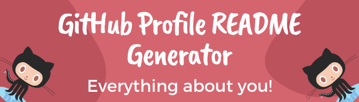

![I am a Full Stack Web Developer.]

# नमस्ते (Namaste) 🙏

## I'm Rishav Singh
I am from Kolkata, West Bengal, India. I love learning new technologies, I like challenges, so i spend most of my time on solving dynamic problems with programming skills that I have learned so far.

## Currently Learning:

 - <b>100 Days of Code.
 
 

## My Skills:

 
 

## My Tools:

 
 

## Find me around the web 🌎:
</a>

- My Website &nbsp;: &nbsp; 
- Practicing on &nbsp;: &nbsp; 
- Follow me on &nbsp;: &nbsp; 
- Finding job on &nbsp;: &nbsp; 
- I fork on &nbsp;: &nbsp; 
- Email Me &nbsp;: &nbsp; 
 
 

## Examples of Work
Coming Soon!
 
 

  

  

