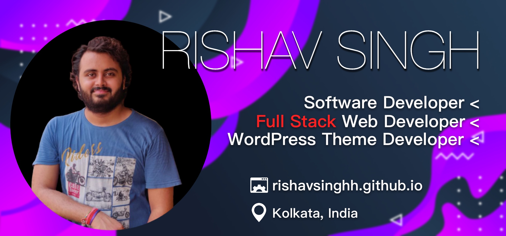

<br/><br/>

# नमस्ते (Namaste) 🙏

# Rishav Singh
I am Rishav Singh from Kolkata, India. <br/><br/>I do Full Stack web development using technologies like <b>PHP, NodeJS etc.</b>, I love learning new technologies such Python. <br/><br/> I like solving challenges on <b>HackerRank</b>, so I also spend time on solving <b>dynamic problems</b> with programming skills that I have learned so far.<br/><br/> I am looking forward to contibuting to <b>open source projects</b> more often.

## Currently Learning:

 - <b>100 Days of Code.
<br/>
<br/>

## My Skills:


<br/><br/>


<br/><br/>


<br/>
<br/>
<br/>

## My Tools:


<br/>
<br/>
<br/>

<!--START_SECTION:waka-->


**🐱 My Github Data** 

> 🏆 55 Contributions in the Year 2020
 > 
> 📦 132.3 kB Used in Github's Storage 
 > 
> 🚫 Not Opted to Hire
 > 
> 📜 3 Public Repositories 
 > 
> 🔑 4 Private Repositories  
 > 
**I'm a Night 🦉** 

```text
🌞 Morning    0 commits      ░░░░░░░░░░░░░░░░░░░░░░░░░   0.0% 
🌆 Daytime    0 commits      ░░░░░░░░░░░░░░░░░░░░░░░░░   0.0% 
🌃 Evening    4 commits      ████████████████████░░░░░   80.0% 
🌙 Night      1 commits      █████░░░░░░░░░░░░░░░░░░░░   20.0%

```
📅 **I'm Most Productive on Sunday** 

```text
Monday       1 commits      █████░░░░░░░░░░░░░░░░░░░░   20.0% 
Tuesday      0 commits      ░░░░░░░░░░░░░░░░░░░░░░░░░   0.0% 
Wednesday    1 commits      █████░░░░░░░░░░░░░░░░░░░░   20.0% 
Thursday     0 commits      ░░░░░░░░░░░░░░░░░░░░░░░░░   0.0% 
Friday       1 commits      █████░░░░░░░░░░░░░░░░░░░░   20.0% 
Saturday     0 commits      ░░░░░░░░░░░░░░░░░░░░░░░░░   0.0% 
Sunday       2 commits      ██████████░░░░░░░░░░░░░░░   40.0%

```


📊 **This Week I Spent My Time On** 

```text
⌚︎ Time Zone: Asia/Kolkata

💬 Programming Languages: 
Python                   10 hrs 3 mins       ██████████████████████░░░   90.09% 
PHP                      1 hr 1 min          ██░░░░░░░░░░░░░░░░░░░░░░░   9.13% 
JSON                     1 min               ░░░░░░░░░░░░░░░░░░░░░░░░░   0.26% 
HTML                     1 min               ░░░░░░░░░░░░░░░░░░░░░░░░░   0.21% 
Git Config               1 min               ░░░░░░░░░░░░░░░░░░░░░░░░░   0.16%

🔥 Editors: 
PyCharmCore              10 hrs 4 mins       ██████████████████████░░░   90.3% 
VS Code                  1 hr 4 mins         ██░░░░░░░░░░░░░░░░░░░░░░░   9.7%

🐱‍💻 Projects: 
pomodoro-start           3 hrs               ██████░░░░░░░░░░░░░░░░░░░   26.97% 
password-manager-start   2 hrs 34 mins       █████░░░░░░░░░░░░░░░░░░░░   23.1% 
day-27                   2 hrs 21 mins       █████░░░░░░░░░░░░░░░░░░░░   21.12% 
password-manager-start 2.1 hr 8 mins         ██░░░░░░░░░░░░░░░░░░░░░░░   10.18% 
monster-university-WP-the1 hr 1 min          ██░░░░░░░░░░░░░░░░░░░░░░░   9.13%

💻 Operating System: 
Mac                      7 hrs 41 mins       █████████████████░░░░░░░░   68.98% 
Windows                  3 hrs 27 mins       ███████░░░░░░░░░░░░░░░░░░   31.02%

```

**I Mostly Code in HTML** 

```text
HTML                     2 repos             ██████████░░░░░░░░░░░░░░░   40.0% 
Hack                     1 repo              █████░░░░░░░░░░░░░░░░░░░░   20.0% 
JavaScript               1 repo              █████░░░░░░░░░░░░░░░░░░░░   20.0% 
Python                   1 repo              █████░░░░░░░░░░░░░░░░░░░░   20.0%

```


**Timeline**

 


<!--END_SECTION:waka-->

<br/>
<br/>
<br/>

  

  

<br/>
<br/>
<br/>

## Find me around the web 🌎:
</a>


- Practicing on &nbsp;: &nbsp; [](rishav09)
- Finding job on &nbsp;: &nbsp; [](https://www.linkedin.com/in/rishavsingh@outlook.in/)
- Email Me &nbsp;: &nbsp; rishavsingh@outlook.in
<br/>
<br/>


## Examples of Work
Coming Soon!
<br/>
<br/>


