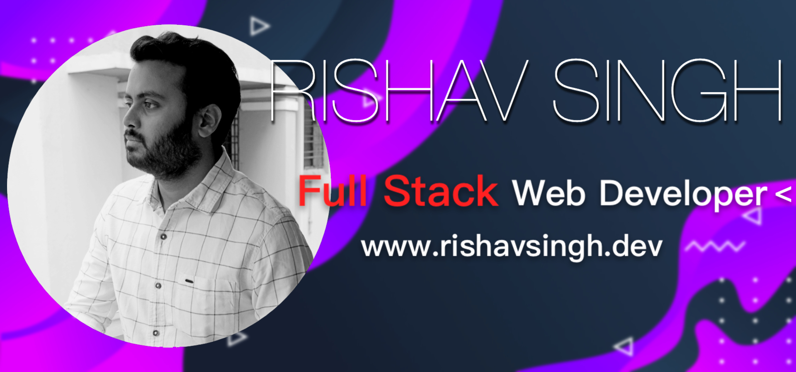
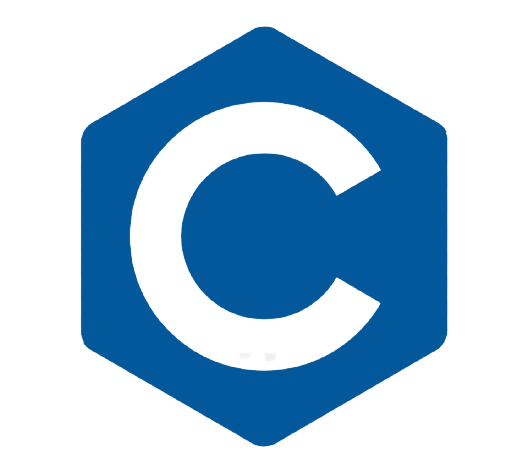
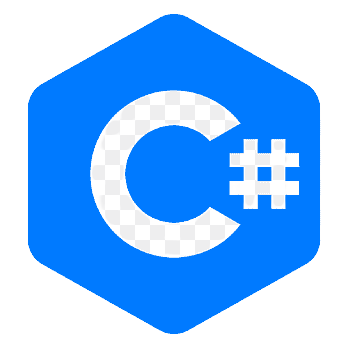
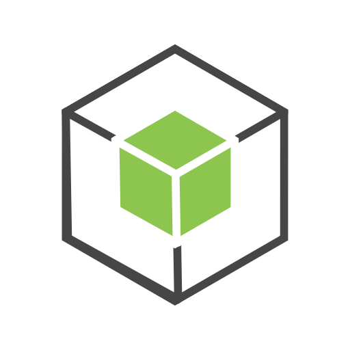

<br/><br/>

# नमस्ते (Namaste) 🙏

# Rishav Singh

I am Rishav Singh from Kolkata, India. <br/><br/>I do Full Stack web development using technologies like <b>NodeJS etc.</b>, I love learning new technologies such Python, Flask. <br/><br/> I like solving challenges on <b>HackerRank</b>, so I also spend time on solving <b>dynamic problems</b> with programming skills that I have learned so far.<br/><br/> I am looking forward to contibuting to <b>open source projects</b> more often.

## Currently Learning:

 - <b>React JS.
<br/>
<br/>

## My Skills:




<br/><br/>


<!-- 

-->
<br/><br/>


<br/>
<br/>
<br/>

## My Tools:


<br/>
<br/>
<br/>

<script src="https://tryhackme.com/badge/432008"></script>

<!--START_SECTION:waka-->
**I'm a Night 🦉** 

```text
🌞 Morning    2 commits      ██░░░░░░░░░░░░░░░░░░░░░░░   7.69% 
🌆 Daytime    5 commits      ████░░░░░░░░░░░░░░░░░░░░░   19.23% 
🌃 Evening    10 commits     █████████░░░░░░░░░░░░░░░░   38.46% 
🌙 Night      9 commits      ████████░░░░░░░░░░░░░░░░░   34.62%

```
📅 **I'm Most Productive on Friday** 

```text
Monday       2 commits      ██░░░░░░░░░░░░░░░░░░░░░░░   7.69% 
Tuesday      0 commits      ░░░░░░░░░░░░░░░░░░░░░░░░░   0.0% 
Wednesday    1 commits      █░░░░░░░░░░░░░░░░░░░░░░░░   3.85% 
Thursday     2 commits      ██░░░░░░░░░░░░░░░░░░░░░░░   7.69% 
Friday       15 commits     ██████████████░░░░░░░░░░░   57.69% 
Saturday     4 commits      ███░░░░░░░░░░░░░░░░░░░░░░   15.38% 
Sunday       2 commits      ██░░░░░░░░░░░░░░░░░░░░░░░   7.69%

```


📊 **This Week I Spent My Time On** 

```text
⌚︎ Time Zone: Asia/Kolkata

💬 Programming Languages: 
JavaScript               2 hrs 27 mins       ████████████████████░░░░░   81.78% 
Python                   32 mins             ████░░░░░░░░░░░░░░░░░░░░░   18.21% 
Git Config               0 secs              ░░░░░░░░░░░░░░░░░░░░░░░░░   0.01%

🔥 Editors: 
VS Code                  2 hrs 51 mins       ███████████████████████░░   94.86% 
PyCharmCore              9 mins              █░░░░░░░░░░░░░░░░░░░░░░░░   5.14%

💻 Operating System: 
Windows                  3 hrs               █████████████████████████   100.0%

```


<!--END_SECTION:waka-->

<br/>
<br/>
<br/>


<br/>
<br/>
<br/>

## Find me around the web 🌎:

</a>

- Practicing on &nbsp;: &nbsp; [](rishav09)
- Finding job on &nbsp;: &nbsp; [](https://www.linkedin.com/in/rishavsingh@outlook.in/)
- Email Me &nbsp;: &nbsp; rishavsingh@outlook.in
  <br/>
  <br/>

## Examples of Work

Coming Soon!
<br/>
<br/>
